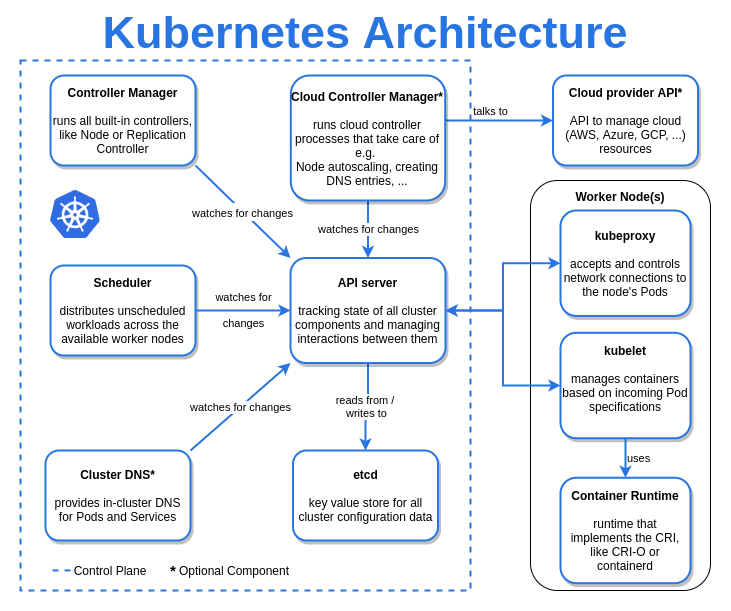

# Introduction:
K8s core concepts makes up 13% of the exam as per internet.
# Architectue:
- K8s cluster consists of a control panel(A cluster of 2n+1 , max recommended is min 3(voting for master selection) and max 7(reduce syncronization overhead) and minions(slave nodes that are used to launch application). 

*Official Architecture:*

*Fron the internet, good for reference:*


- kubectl is a command line tool that is used to send command to the api server to operate k8s.
- Frequently used kubernetes objects
    - POD (the most granular k8s object)
    - ReplicaSet (Group pods) [Replication Controller - the old solution of ReplicaSet]
    - Deployment group (Enhances Replicaset)
    - Stateful Set
    - Service (Internal load balancer - routes traffic to a group of homogenous pods)
    - Ingress (External Load balancer - routes traffic to different services)
    - HPA (Horizontal Pod Autoscaling) 
    - DaemonSet(If you need to run a POD in every node)
- Scheduler decides which controler runs on which Node.
- Kubernetes object definition uses a yaml file and has 4 keys - 
    - api version
    - kind
    - metadata:
        - name: STRING
        - label: <KEY-VALUE>
        - annotations: <KEY-VALUE>
- Kubernetes master node usually runs the following containers, can run more containers related to k8s cluster management.
```
coredns-6d4b75cb6d-vptj2           1/1     Running   0               6d7h
etcd-minikube                      1/1     Running   0               6d7h
kube-apiserver-minikube            1/1     Running   0               6d7h
kube-controller-manager-minikube   1/1     Running   0               6d7h
kube-proxy-6wp5m                   1/1     Running   0               6d7h
kube-scheduler-minikube            1/1     Running   0               6d7h
metrics-server-8595bd7d4c-kqr84    1/1     Running   0               5h21m
storage-provisioner                1/1     Running   41 (4d5h ago)   6d7h
```
By default, it prevents application pods to be running on master nodes by using a tainit(a k8s feature which we are gonna study later.)
- Kubelet runs on including master node! Welcome to distrubuted system!
- What makes worker node a worker node? (in simple term)
    - Having 3 processes running on that machine (and of course configured correctly), ensures containers are running as expected.
        - Container runtime
        - kubelet (launches cotnainer using container runtime,also gather data and send to api server)
        - kube-proxy (routes traffic to a pod)
- What makes master node a master node? (in simple term)
    - Having 4 processes running there
        - api server
        - scheduler
        - controller manager
        - etcd
    * master is also a node that runs pods so, all the minion node components are also there! Hence, don't be surprised if you discover a kubelet running in your master node!

- Todo: DNS, CNI and networking (not studied deeply, will do it during CKA exam)

# Practice problem:
- Check the cluster information you are working on
    ```
    kubectl cluster-info
    Kubernetes control plane is running at https://127.0.0.1:49921
    CoreDNS is running at https://127.0.0.1:49921/api/v1/namespaces/kube-system/services/kube-dns:dns/proxy
    ```
- Get the nodes in the cluster
    ```
    kubectl get nodes    
    NAME       STATUS   ROLES           AGE    VERSION
    minikube   Ready    control-plane   6d8h   v1.24.3
    ```


# POD
- In a multicontainer pod if one container fails the whole pod will restart(CrashLoopBackOff).
- Run a busybox image with resource limit defined using imperative command
    - kubectl run busybox --image=busybox --restart=Never -- /bin/sh -c "sleep 10"
- Run a temporary busybox pod
    - kubectl run tmp --rm -it --restart=Never --image=busybox -- wget -O- google.com # --restart=Never is very important # -it is required to avoid error that '--rm should only be used for attached containers'
    - kubectl run tmp --rm -it --restart=Never --image=busybox -- /bin/sh -c 'wget -O- google.com' # using bin bash
    - kubectl run tmp --rm -it --restart=Never --image=busybox --labels=access=granted -- wget -O- http://nginx:80 --timeout 2 # labeling a temporary pod helps when there is a network policy that dictates that the ingress to nginx is allowed only from pods with label=access=granted
    - kubectl run tmp --restart=Never --image=busybox  --labels=tier=db,app=practice --dry-run -o yaml # multiple labels

- With port 
    - kubectl run nginx --image=nginx --port=8080 --dry-run=client -o yaml

- With port & service
    - kubectl run nginx --image=nginx --port=8080 --expose --dry-run=client -o yaml

- Pass environment variable 
    - kubectl run nginx --image=nginx --port=8080 --env=var1=val1 --env=var2=val2 --dry-run=client -o yaml
    - kubectl run tmp --rm -it --restart=Never --image=busybox --env=var1=val1 --env=var2=val2 -- /bin/sh -c 'env'
- Run lots of pods with loop 
    - for i in `seq 1 3` ; do kubectl run tmp$i --rm -it --restart=Never --image=busybox -- wget -O- google.com ; done;
- kubectl run tmp  --rm -it --restart=Never --image=busybox  --labels=tier=db,app=practice  -- /bin/sh -c 'echo a;echo b;echo c'

# Namespaces
- Get all the namespace in a cluster
    - kubectl get ns
- Count number of ns in a cluster
    - kubectl get ns --no-headers | wc -l
- Run a command in a spacific namespace 
    - kubectl -n < NAME OF THE NAMESPACE>
- Find number of pods in namespace 'kube-system'
    - kubectl -n kube-system  get pods --no-headers | wc -l
- Which namesspace has the pod etcd-minikube 
    - kubectl get pod  -A  | grep 'etcd-minikube' # first column is the namespace

# DNS
- FQDN of the cluster - `cluster.local`
- DNS Records 
    - What objects get DNS records?
        - Services (`my-svc.my-namespace.svc.cluster.local`)
        - Pods (`pod-ip-address.my-namespace.pod.cluster-domain.example`)
        ```
        Pod's hostname and subdomain fields 
        Currently when a Pod is created, its hostname is the Pod's metadata.name value.

        The Pod spec has an optional hostname field, which can be used to specify the Pod's hostname. When specified, it takes precedence over the Pod's name to be the hostname of the Pod. For example, given a Pod with hostname set to "my-host", the Pod will have its hostname set to "my-host".

        The Pod spec also has an optional subdomain field which can be used to specify its subdomain. For example, a Pod with hostname set to "foo", and subdomain set to "bar", in namespace "my-namespace", will have the fully qualified domain name (FQDN) "foo.bar.my-namespace.svc.cluster-domain.example".
        ```
 # Service
 - We can expose pod,deployment by creating service for doing internal/external load balancing 

 # Deployment
 - 
 # Docker Basic
 - docker run ubuntu - container exists immidiately. Because there is no process run by the user that is in running state. Container only lives as long as the process inside it is alive. 
 - `Who defines what process will be run within the container?`. The dockerfile CMD statement. For nginx it's CMD['nginx'], for mysql its CMD["mysqld], for ubuntu its CMD["bash"], and since bash in not a long running process hence the ubuntu container exits. CMD["terminal"]  would be different since it listens for stdin.
 - We can overwrite the default CMD in dockerfile by `docker run ubuntu sleep`
 - How do we run always run the sleep command with argument 10 (sleep 10 seconds)? `CMD ["sleep", "10"]` - first element of the array is always just the process name, rest of the commands are aguments.
 - How do I make the sleeptime dynamic? `ENTRYPOINT ["sleep"]` - specify the program that will be run when the container starts.
 - Final command = process + argument => process comes from ENTRYPOINT, argument is comming from CMD.
 - Use both entrypoint and command to run a process(entrypoint) with a default argument(command). If no argument is passed from the docker run command, then the it will look for default CMD [DEFAULT_ARG] , if it's not there , then will raise an error if the process expects an argument.
 - Overwrite ENTRYPOINT to run a different process when the docker container starts? - `use --entrypoint`
 - *Concerting to K8s*
    - Pass argument : .spec.container[].args
        - args : [] # kubectl run bb --image=busybox --dry-run=client -o yaml -- /bin/bash -c sleep 10
    - Overwrite the entrypoint:
        - command: ["sleepV2"]

